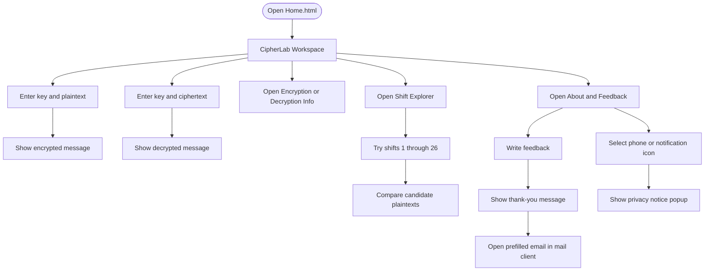
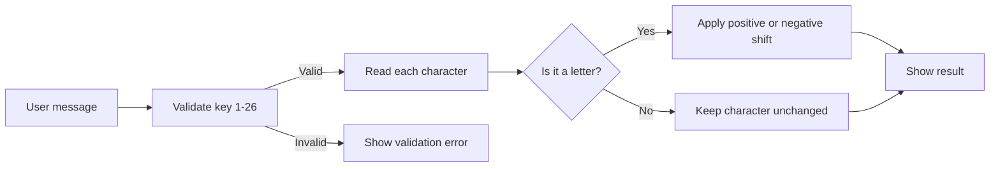

# CipherLab

CipherLab is a browser-based cryptography learning tool. It introduces the concepts of encryption and decryption and provides an interactive Caesar cipher workspace for experimenting with text and shift keys.

The project is built with plain HTML, CSS, and JavaScript. It has no server, build process, package manager, or external runtime dependency.

## Contents

- [Overview](#overview)
- [Features](#features)
- [Application Flow](#application-flow)
- [Page Guide](#page-guide)
- [Run Locally](#run-locally)
- [How the Cipher Works](#how-the-cipher-works)
- [Feedback and Privacy](#feedback-and-privacy)
- [Project Structure](#project-structure)
- [Design and Accessibility](#design-and-accessibility)
- [Limitations and Security](#limitations-and-security)
- [Repository Details](#repository-details)

## Overview

CipherLab is intended for students and beginners who want to understand the basic relationship between plaintext, ciphertext, keys, encryption, and decryption.

The main workspace supports:

1. Encrypting a message with a key from 1 to 26.
2. Decrypting a message with a key from 1 to 26.
3. Preserving spaces, punctuation, and other non-letter characters.
4. Displaying readable success or error feedback.

## Features

- Responsive interface for desktop and mobile screens.
- Shared visual system across all pages.
- Caesar cipher encryption and decryption workspace.
- Shift Explorer that tests all 26 possible Caesar shifts.
- Educational pages explaining encryption and decryption.
- Feedback form with character counter and validation.
- Feedback confirmation message after submission.
- Optional prefilled email link to `bhavyareddy9381@gmail.com`.
- Phone and notification icons with a privacy explanation popup.
- Footer with author, LinkedIn, GitHub, and copyright details.
- Runs directly from local files in a modern browser.

## Application Flow



## Page Guide

### `Home.html` - Workspace

The primary tool. It contains separate Encryption and Decryption panels.

- Encryption accepts a key from 1 to 26 and a plaintext message.
- Decryption accepts a key from 1 to 26 and an encrypted message.
- The result appears below the panels.
- The local `video.mp4` asset is used as a subtle background layer.

### `Encryption.html` - Encryption Information

Explains plaintext, ciphertext, algorithms, keys, symmetric encryption, asymmetric encryption, key management, performance, and cryptanalysis.

### `Decryption.html` - Decryption Information

Explains the purpose of decryption, decryption keys, symmetric key decryption, and security considerations.

### `hack.html` - Shift Explorer

Accepts encrypted text in a multiline textarea and displays every Caesar shift from 1 to 26. This is useful when the key is unknown and the learner needs to compare possible results.

### `About.html` - Feedback

Contains the feedback workflow:

1. Enter a message in the feedback textarea.
2. Select **Submit feedback**.
3. Read the confirmation message.
4. Select **Send this feedback by email** to open a prefilled email.

The phone and email notification icons do not expose contact details. Selecting either icon displays a privacy notice explaining that the option is disabled for now.

## Run Locally

### Option 1: Open directly

Double-click `Home.html`, or open it in a browser using the file path.

### Option 2: Use a local server

From the project directory, run any simple static server. For example, with Python:

```powershell
python -m http.server 8000
```

Then open <http://localhost:8000/Home.html>.

Using a local server can provide more consistent media behavior than opening HTML files with a `file:` URL.

## How the Cipher Works

CipherLab uses a Caesar shift. Each letter is moved forward or backward through the alphabet by the selected key.

For encryption:

```text
encrypted character = (character position + key) modulo 26
```

For decryption:

```text
decrypted character = (character position - key + 26) modulo 26
```

Example with key `3`:

```text
Plaintext:  hello, world!
Ciphertext: khoor, zruog!
```

Only English alphabetic characters are shifted. Spaces, numbers, punctuation, and other characters are preserved.



## Feedback and Privacy

The feedback form is client-side only. Submitting feedback displays a confirmation in the page; it does not send data automatically to a server.

The optional email action creates a `mailto:` link with:

- Recipient: `bhavyareddy9381@gmail.com`
- Subject: `CipherLab Feedback`
- Body: the submitted feedback message

Selecting the link opens the visitor's configured email application. Whether an email application opens depends on the browser and operating system configuration.

Phone contact and email notifications are intentionally unavailable for now due to privacy reasons. The icons provide an explanation popup instead of exposing a phone number or enabling notifications.

## Project Structure

```text
Hack/
├── About.html         # Feedback and privacy notice page
├── Decryption.html    # Decryption concepts
├── Encryption.html    # Encryption concepts
├── Home.html          # Main encryption/decryption workspace
├── README.md          # Project documentation
├── d.jpg              # Decryption panel image
├── e.jpg              # Encryption panel image
├── hack.html          # Caesar Shift Explorer
├── logo.gif           # Project logo asset
├── styles.css         # Shared responsive styles
└── video.mp4          # Workspace background media
```

## Design and Accessibility

- Semantic headings, navigation, forms, buttons, labels, and footer landmarks are used throughout the interface.
- Form fields have visible labels and focus styles.
- Phone and notification icons include accessible names and tooltips.
- The privacy notice uses an alert dialog role and can be dismissed with a close action or the **Understood** button.
- Layouts adapt to narrow screens without horizontal scrolling.
- External author links open in a new tab with `rel="noreferrer"`.

## Limitations and Security

This project is an educational demonstration, not a production security tool.

- Caesar cipher encryption is trivial to break and must not protect real data.
- There is no backend, database, authentication, or server-side validation.
- Feedback is not persisted by CipherLab.
- Email delivery depends on the user's configured mail client.
- Do not enter passwords, personal secrets, or confidential information into the demo.

For real applications, use established cryptographic libraries and protocols such as AES-GCM or TLS rather than implementing cryptography manually.

## License

No license has been specified for this project yet. Add a license before distributing or accepting external contributions.
